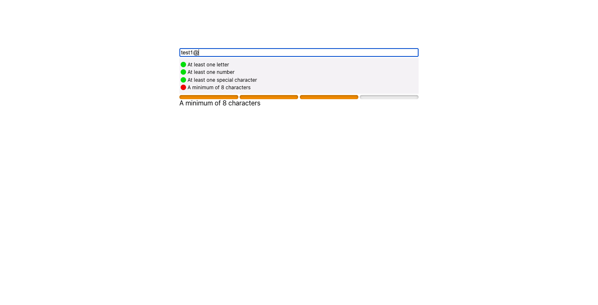

## Installation

You can install this package using npm:

```bash
npm install react-input-checker
```

## Usage

To use the `Validator` in your React application:

```jsx
import { useState } from "react";
import { ListValidator, ProgressValidator } from "react-input-checker";
import "react-input-checker/dist/styles/validator.css";

function App() {
  const [value, setValue] = useState("");
  return (
    <div className="App">
      <input
        value={value}
        onChange={(e) => setValue(e.target.value)}
        id="test"
      />
      <ListValidator
        rules={[
          { rule: /.*[a-zA-Z].*/, message: "At least one letter" },
          { rule: /.*[0-9].*/, message: "At least one number" },
          {
            rule: /[!@#$%^&*(),.?":{}|<>]/,
            message: "At least one special character",
          },
          { rule: /^(.{8,})$/, message: "A minimum of 8 characters" },
        ]}
        value={value}
      />
      <ProgressValidator
        rules={[
          { rule: /.*[a-zA-Z].*/, message: "At least one letter" },
          { rule: /.*[0-9].*/, message: "At least one number" },
          {
            rule: /[!@#$%^&*(),.?":{}|<>]/,
            message: "At least one special character",
          },
          { rule: /^(.{8,})$/, message: "A minimum of 8 characters" },
        ]}
        value={value}
      />
    </div>
  );
}

export default App;
```



## Contributing

Contributions are welcome!

## License

This project is licensed under the MIT License - see the [LICENSE.md](LICENSE.md) file for details.
